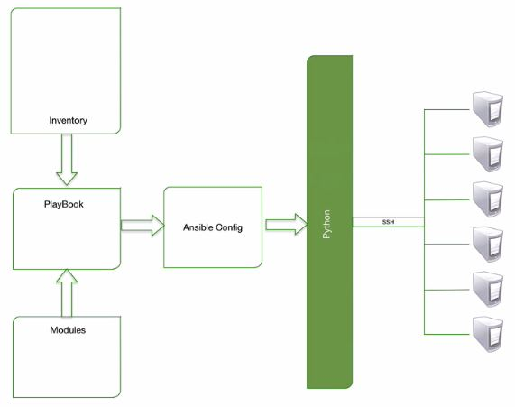

# Architechture and Process Flow

- ***Architechture***
	- An Ansible Control Server will talks to the Remote System
	- Control server is the primary server which deploys our plays and playbooks
	- In this case we don't need a dedicated server to act as a Control Server
	- A control server is just a host from where we want to control the Infrastucture like aur destop / laptop

- ***Requirements***
	- As ansible is written in Python we should have Python 2.5 or later installed on Control Server
	- Installed and configured OpenSSH




- ***Components***
	- Inventory
		- Hosts and Groups
		- Host Variables
		- Group Variables
		- Groups of Groups, and Group Variables
		- Default groups
		- Splitting Out Host and Group Specific Data
		- List of Behavioral Inventory Parameters
		- Non-SSH connection types
	- Modules
		- Ansible ships with a number of modules (called the ‘module library’) that can be executed directly on remote hosts or through Playbooks.
		- Users can also write their own modules.
		- These modules can control system resources, like services, packages, or files (anything really), or handle executing system commands.
	- Playbooks
		- Playbooks are Ansible’s configuration, deployment, and orchestration language.
		- They can describe a policy you want your remote systems to enforce, or a set of steps in a general IT process.
		- Playbook is a collection of plays
		- A play is a single or set of tasks using modules, executed on a defined set of hosts.
		- If Ansible modules are the tools in your workshop, playbooks are your instruction manuals, and your inventory of hosts are your raw material.
		- At a basic level, playbooks can be used to manage configurations of and deployments to remote machines.
		- At a more advanced level, they can sequence multi-tier rollouts involving rolling updates, and can delegate actions to other hosts, interacting with monitoring servers and load balancers along the way.
		- Playbooks are designed to be human-readable and are developed in a basic text language.
	- Configuration File
		- Certain settings in Ansible are adjustable via a configuration file. The stock configuration should be sufficient for most users, but there may be reasons you would want to change them.
		- Changes can be made and used in a configuration file which will be processed in the following order:
		
		```
		* ANSIBLE_CONFIG (an environment variable)
		* ansible.cfg (in the current directory)
		* .ansible.cfg (in the home directory)
		* /etc/ansible/ansible.cfg
		```

		- Prior to 1.5 the order was:

		```
		* ansible.cfg (in the current directory)
		* ANSIBLE_CONFIG (an environment variable)
		* .ansible.cfg (in the home directory)
		* /etc/ansible/ansible.cfg
		```

		- Ansible will process the above list and use the first file found. Settings in files are not merged.
